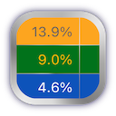

*** IMPORTANT NOTE as of August 2022, FlowAllocator will be open source. All ‘Investor’ features that were formerly an in-app purchase are now available to all users. ***

# Welcome to FlowAllocator

_FlowAllocator_ is a portfolio rebalancing tool for do-it-yourself investors.

Whether your strategy is passive or active, or whether you rebalance annually or more frequently, _FlowAllocator_ can provide flexibility in managing those rebalances, and help you save time, gain insight, and discover new opportunities.

_FlowAllocator_ offers features accessible to those new to investing, as well as sophisticated capabilities for those who are managing multiple investment strategies across multiple accounts.

Your privacy is paramount. Financial data in _FlowAllocator_ stays local to your computer. None of it is uploaded to the cloud. No connection to remote providers is involved. 

[Available for download](https://apps.apple.com/us/app/flowallocator/id1572300664) in the Mac App Store. (U.S. only for now)

[FlowAllocator Documentation](/allocator/contents/index.html)

## Demo of Features for Basic Version

No purchase is required for the basic version. It’s free to use!

### This video shows...

* how to set up your portfolio in _FlowAllocator_,
* how a target allocation can _flow_ across accounts, including with user-specified limits,
* how to monitor the metrics of a rebalance (net gains, sale volume, etc.),
* how to incorporate non-trading assets into your allocation, and
* how to watch for potential wash situations

 

<iframe src="https://player.vimeo.com/video/642208467?badge=0&amp;autopause=0&amp;player_id=0&amp;app_id=58479" frameborder="0" allow="autoplay; fullscreen; picture-in-picture" allowfullscreen style="position:absolute;top:0;left:0;width:100%;height:100%;" title="FlowAllocator-Basic-1 - HD 1080p.mov"></iframe>

 

## Demo of Advanced Features

(As of August 2022, advanced features are available to all users, formerly available with an in-app annual subscription.)

Advanced Features include:

* Enabling 'Shuffle' to randomly sort the account and asset order, as well as a random flow slider position.
* Enabling the three 'Consolidation' options.
* Enabling the Optimizer, to systematically search through the allocation space.

### This video shows...

* how to reduce trades/volume through consolidating assets in the target allocation,
* how to incorporate holdings whose asset classes are not in the target allocation,
* how to reduce trades/volume through consolidating rebalance trades, and
* how to find an optimal allocation for the rebalance of a complex strategy

 

<iframe src="https://player.vimeo.com/video/574781071?badge=0&amp;autopause=0&amp;player_id=0&amp;app_id=58479" frameborder="0" allow="autoplay; fullscreen; picture-in-picture" allowfullscreen style="position:absolute;top:0;left:0;width:100%;height:100%;" title="FlowAllocator-Premium-1 - HD 1080p.mov"></iframe>

 

## Import Support

Through the _FINporter_ project in _OpenAlloc_, _FlowAllocator_ supports\* the direct import of export files from some brokerages (and services). These presently include:

| Service | Type | Notes |
| ------- | ---- | ------- |
| [Fidelity Investments](https://fidelity.com) | Brokerage | |
| [Schwab Brokerage Services](https://schwab.com) | Brokerage | New in October 2021 |
| [Allocate Smartly](https://allocatesmartly.com) | Tactical Allocation Provider | |

 

See the _FINporter_ [README](https://github.com/openalloc/FINporter) for more details.

Where direct import of brokerage statements isn't available, you can import data using delimited (CSV, etc.) tables using the formats specified in _AllocData_. See its [README](https://github.com/openalloc/AllocData) for more details.

\*_Support of any service, including those mentioned above, is neither a recommendation nor endorsement. Do your own research to find suitable vehicles to meet your investment objectives, or seek professional guidance._

## Screen Images

_Sidebar and Flow Slider:_

_Rebalance Guide:_

_Optimizer (with subscription):_

## Requirements

Requires macOS Big Sur (11.0) or later, running on Intel or Apple Silicon.

